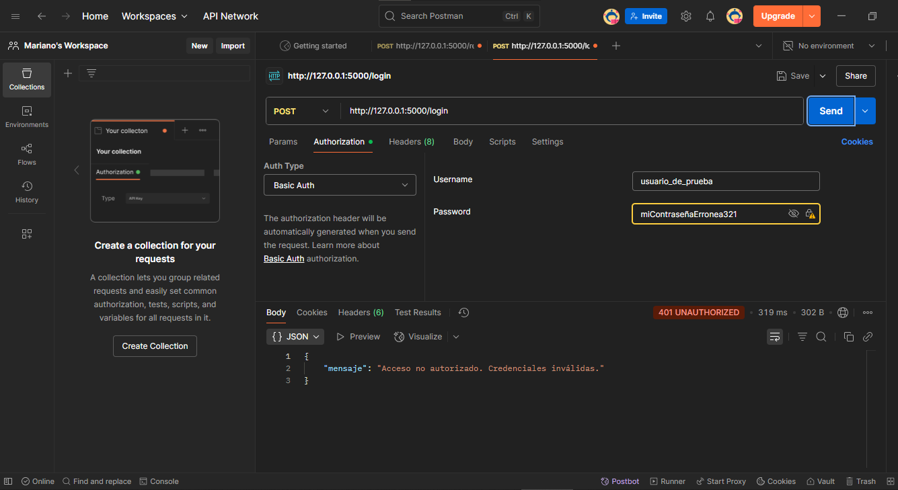

# Práctica Formativa Obligatoria Nº 2

# Integrantes del Grupo
- Constantin, Madelaine
- Maidana, Martin Nicolas
- Marin, Mariano Daniel
- Ramis Veron, Lorena
- Sazycz, Pablo

# Sistema de Gestión de Tareas con API y Base de Datos

Este proyecto implementa un sistema básico de gestión de tareas con una API REST desarrollada en Flask, que incluye registro de usuarios, inicio de sesión con autenticación básica y una sección de tareas.
Los datos de usuarios y tareas se persisten en una base de datos SQLite.

## Requisitos

* Python 3.x
* Pip (gestor de paquetes de Python)

## Instalación

1.  **Clonar este repositorio** (si lo obtuviste de GitHub):
    ```bash
        git clone [https://github.com/MarianoD-Marin-Lobo/ProgrRedes_PFO2_Sist-Gestion-Tareas-Con-API-y-BD]
        (https://github.com/MarianoD-Marin-Lobo/ProgrRedes_PFO2_Sist-Gestion-Tareas-Con-API-y-BD)
        
        cd ProgrRedes_PFO2_Sist-Gestion-Tareas-Con-API-y-BD
    ```

2.  **Crea un entorno virtual** (opcional pero recomendado):
    ```bash
        python -m venv venv
        # En Windows:
        venv\Scripts\activate
        # En macOS/Linux:
        source venv/bin/activate
    ```

3.  **Instala las dependencias:**
    ```bash
        pip install Flask Flask-HTTPAuth Werkzeug passlib
    ```

## Estructura del Proyecto

ProgrRedes_PFO2_Sist-Gestion-Tareas-Con-API-y-BD
│   
├─── database.db (se generará automáticamente al ejecutar el servidor)
├─── Readme.md 
└─── server.py

## Ejecución del Servidor

1.  Asegurarse de estar en el directorio raíz del proyecto (donde se encuentra `server.py`).
2.  Ejecutar el servidor Flask:
    ```bash
        python server.py
    ```
    Verás un mensaje en la consola indicando que el servidor se está ejecutando, probablemente en `http://127.0.0.1:5000/` o `http://localhost:5000/`.

    **Nota:** Al iniciar el servidor por primera vez, se creará automáticamente el archivo `database.db` y las tablas `usuarios` y `tareas`.

---

## ----------- Endpoints de la API -----------

A continuación se explican, mediante ejemplos correspondientes, como probar los endpoints usando **Postman**, para lo cual se debe asegurar que el servidor Flask (`server.py`) esté ejecutándose antes de enviar cualquier solicitud.

El servidor se ejecuta en `http://127.0.0.1:5000/`.


### 1. Registro de Usuarios

* **Endpoint:** `POST /registro`
* **Descripción:** Permite registrar nuevos usuarios en el sistema. Las contraseñas se almacenan hasheadas.

**Instrucciones:**

1.  Abrir una **nueva pestaña** de solicitud en Postman.
2.  Seleccionar el método **`POST`**.
3.  En el campo de URL, escribir: `http://127.0.0.1:5000/registro`
4.  Ir a la pestaña **`Headers`** y añadir una nueva clave-valor:
    * `Key`: `Content-Type`
    * `Value`: `application/json`
5.  Ir a la pestaña **`Body`**.
    * Seleccionar la opción **`raw`**.
    * En el desplegable de la derecha, elegir **`JSON`**.
    * En el cuadro de texto, ingresar el siguiente JSON (cambiar `nombre_de_usuario` y `tu_contraseña` según se desee y/o necesite):
        ```json
        {
            "usuario": "nombre_de_usuario",
            "contrasena": "tu_contraseña"
        }
        ```
6.  Hacer clic en **`Send`** para enviar la solicitud.

* **Respuestas posibles:**
    * `201 Created`: Usuario registrado exitosamente.
    * `400 Bad Request`: Datos de usuario o contraseña faltantes.
    * `409 Conflict`: El usuario ya existe.


### 2. Inicio de Sesión

* **Endpoint:** `POST /login`
* **Descripción:** Verifica las credenciales del usuario y permite el acceso a rutas protegidas. Requiere autenticación HTTP Basic.

**Instrucciones:**

1.  Abrir una **nueva pestaña** de solicitud en Postman.
2.  Seleccionar el método **`POST`**.
3.  En el campo de URL, escribir: `http://127.0.0.1:5000/login`
4. Ir a la pestaña **`Authorization`**.
    * En el desplegable `Type`, seleccionar **`Basic Auth`**.
    * En el campo `Username`, escribir el nombre de usuario registrado en el paso anterior de Registro de usuario.
    * En el campo `Password`, escribir la contraseña correspondiente al usuario registrado en el paso anterior de Registro de usuario.
5.  Hacer clic en **`Send`** para enviar la solicitud.

* **Respuestas posibles:**
    * `200 OK`: Inicio de sesión exitoso.
    * `401 Unauthorized`: Credenciales inválidas.


### 3. Gestión de Tareas

* **Endpoint:** `GET /tareas`
* **Descripción:** Muestra un HTML de bienvenida una vez que el usuario está autenticado. (En una versión futura, aquí se listarían las tareas del usuario).

**Instrucciones:**

1.  Abrir una **nueva pestaña** de solicitud en Postman.
2.  Seleccionar el método **`GET`**.
3.  En el campo de URL, escribir: `http://127.0.0.1:5000/tareas`
4.  Ir a la pestaña **`Authorization`**.
    * En el desplegable `Type`, seleccionar **`Basic Auth`**.
    * En el campo `Username`, escribir el nombre de usuario válido.
    * En el campo `Password`, escribir la contraseña correcta.
5.  Hacer clic en **`Send`** para enviar la solicitud.

* **Respuestas posibles:**
    * `200 OK`: Se muestra el HTML de bienvenida.
    * `401 Unauthorized`: Credenciales inválidas.

## ------------------------------------------


## ----------- Cliente en Consola -----------

El proyecto incluye también un archivo `cliente.py` que funciona como un cliente en consola. 
Permite interactuar con la API REST desarrollada en `server.py`.

### Funcionalidades del cliente:

- Registrar usuarios nuevos (`POST /registro`)
- Iniciar sesión con autenticación básica (`POST /login`)
- Acceder al HTML de bienvenida (`GET /tareas`), si el inicio de sesión es exitoso.


### Requisitos adicionales

Este cliente utiliza la librería `requests`. Si no está instalada, se debe ejecutar:

```bash
    pip install requests
```


### Pruebas

1.  **Registro EXITOSO de usuario (POSTMAN).** 


2.  **Registro FALLIDO de usuario por ser un usuario ya existente (POSTMAN).**


3.  **Inicio de sesión EXITOSO (POSTMAN).**


4.  **Inicio de sesión FALLIDO por credenciales inválidas (POSTMAN).**



5.  **Acceso EXITOSO a la Gestión de Tareas (POSTMAN)**


6.  **Acceso FALLIDO a la Gestión de Tareas por credenciales incorrectas y/o falta de autenticación (POSTMAN)** 


7. **Vista a la Base de Datos donde se confirma las contraseñas se almacenan efectivamente HASHEADAS**


8. **Registro EXITOSO de usuario (Cliente consola).**


9. **Registro FALLIDO de usuario por ser un usuario ya existente (Cliente consola).**


10. **Inicio de sesión EXITOSO y Acceso a HTML/Tareas (Cliente consola).**


11. **Inicio de sesión FALLIDO (Cliente consola)**


**Acceso al repositorio**
https://github.com/MarianoD-Marin-Lobo/ProgrRedes_PFO2_Sist-Gestion-Tareas-Con-API-y-BD


**Preguntas conceptuales**

**¿Por qué hashear contraseñas?**
    Hashear contraseñas es una medida de seguridad para proteger los datos de los usuarios. En lugar de guardar la contraseña tal como la escribe el usuario, se guarda una versión codificada que no se puede leer directamente. Así, si alguien accede a la base de datos, no podrá ver ni usar las contraseñas reales. Es una forma de cuidar la privacidad y evitar que se filtren datos sensibles ante cualquier falla o ataque.

**Ventajas de usar SQLite en este proyecto**
    SQLite es ideal para este tipo de trabajos porque es una base de datos liviana, fácil de usar y no requiere instalar un servidor aparte. Funciona directamente desde un archivo, lo cual simplifica mucho la configuración y la hace perfecta para proyectos pequeños, de práctica o con pocos usuarios. Además, se integra bien con Python y permite guardar los datos de forma ordenada y permanente sin complicaciones.